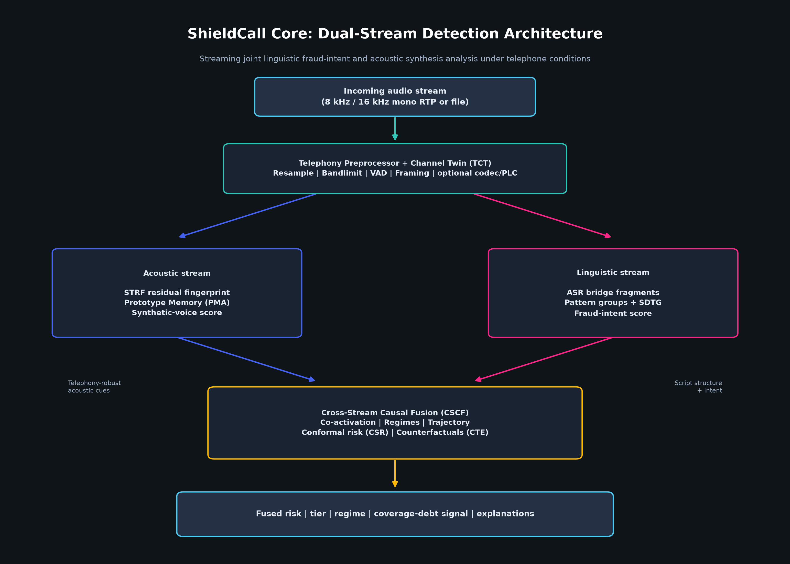
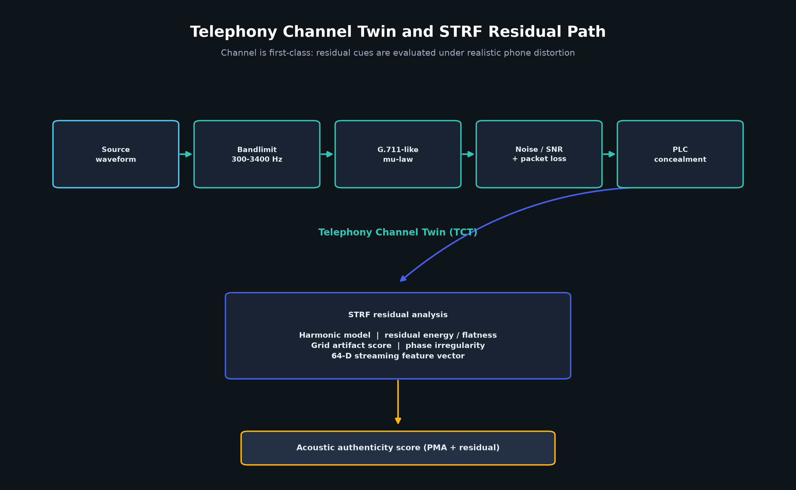
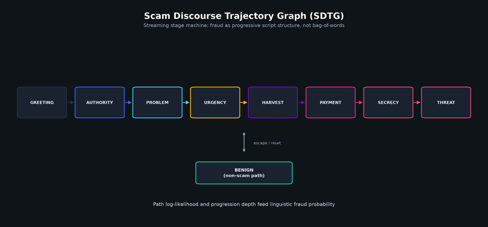
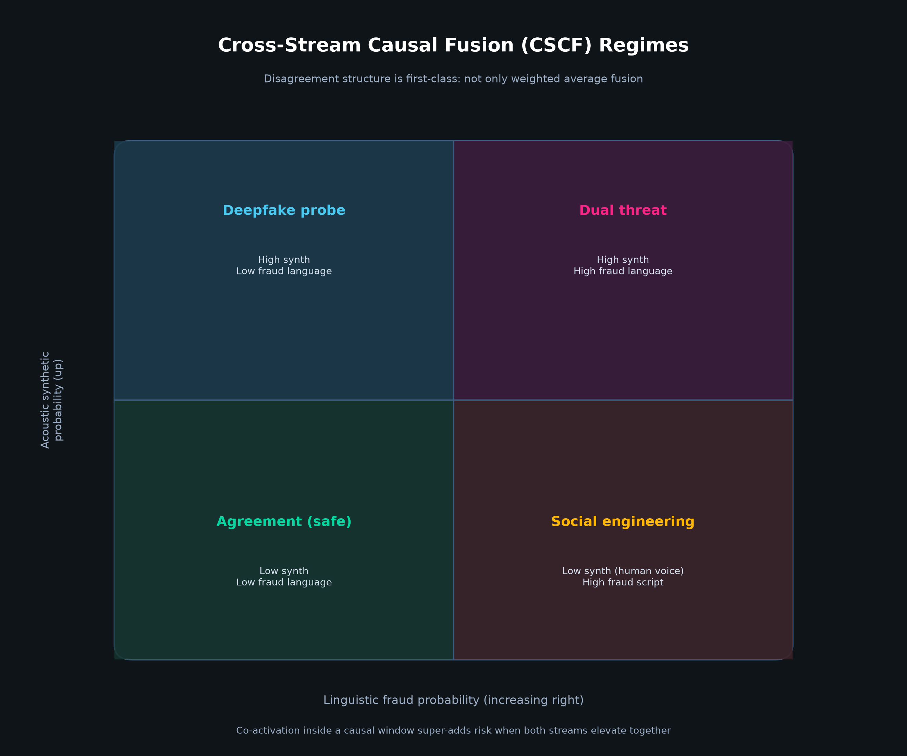
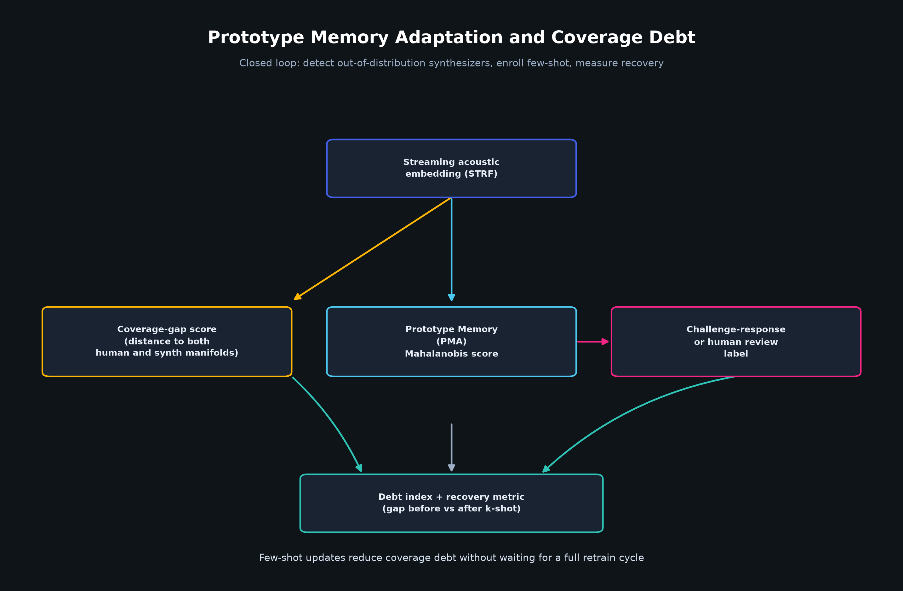
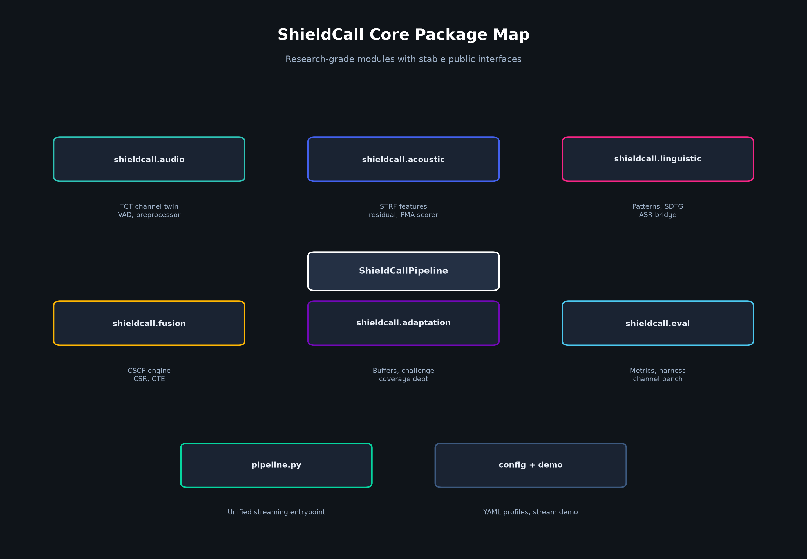

# ShieldCall Core Architecture

## Mission

Real-time joint detection of **voice synthesis** and **linguistic fraud intent** on telephone audio, under the channel conditions that actually exist (narrowband, G.711, packet loss), with **measurable adaptation** when new synthesizers appear.

## System data flow



Incoming audio is prepared by the telephony preprocessor (optionally through the Channel Twin). Frames feed the acoustic stream (STRF and prototype memory) and, via an ASR bridge, the linguistic stream (patterns and SDTG). Cross-Stream Causal Fusion produces risk, tier, regime, conformal bands, and counterfactual explanations, along with a coverage-debt signal.

## Telephony and residual acoustics



The Channel Twin applies bandlimiting, mu-law style quantization, noise, packet loss, and packet-loss concealment. STRF builds a residual fingerprint after a lightweight harmonic model so synthetic structure can still be scored after telephone distortion.

## Scam discourse trajectory



SDTG models classic vishing scripts as a progressive stage path (greeting through threat). Path score and progression depth are first-class linguistic features, not post-hoc labels.

## Fusion regimes



| Regime | Acoustic | Linguistic | Interpretation |
|--------|----------|------------|----------------|
| Agreement (safe) | Low synth | Low fraud | Streams agree on low threat |
| Social engineering | Low synth | High fraud | Human voice; script is the weapon |
| Deepfake probe | High synth | Low fraud | Synthetic voice; language secondary |
| Dual threat | High synth | High fraud | Both streams hostile |

## Adaptation and coverage debt



Prototype Memory accepts few-shot labeled embeddings. Coverage gap measures distance from both human and synthetic manifolds. Challenge-response or human review can enroll new synthesizer families and reduce debt without a full retrain.

## Package map



```
shieldcall/
 audio/ preprocessor, VAD, channel twin
 acoustic/ STRF features, residual, prototype scorer
 linguistic/ patterns, discourse graph, ASR bridge
 fusion/ CSCF engine, conformal, explain
 adaptation/ buffers, challenge-response, coverage debt
 eval/ metrics, harness, synthetic benchmark
 demo/ streaming demo
 pipeline.py single entrypoint
 config.py YAML profiles
```

## Latency budget (target)

| Stage | Budget |
|-------|--------|
| Frame and VAD | under 1 ms |
| STRF and features | under 5 ms |
| Acoustic score | under 2 ms |
| Linguistic update | under 1 ms |
| Fusion and conformal | under 1 ms |
| **Total per frame** | well under 20 ms (real-time at 10 ms hop) |

## Version

0.2.0: full research skeleton with runnable science, tests, channel-aware evaluation, and rendered figures. Neural weight files and large telephony corpora remain the next training milestone.

## Regenerating figures

```bash
python scripts/render_diagrams.py
```

Outputs land in `docs/figures/*.png`.
