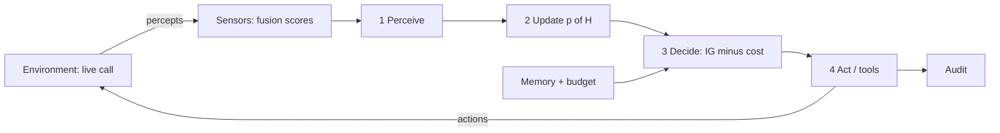

# ShieldCall Core Architecture

## Mission

Real-time joint detection of **voice synthesis** and **linguistic fraud intent** on telephone audio, under the channel conditions that actually exist (narrowband, G.711, packet loss), with **measurable adaptation** when new synthesizers appear.

The detector is a **sensor**. A **belief-state defense agent** sits above it, spends an interruption budget, and never sees raw audio.

## Agent (v0.5)



The published figure is the closed cycle in `figures/agent_loop.png`: PEAS, sensors, four-step interior (perceive / update belief / decide / act), six actuators, hypotheses $H$, budget, human escalate, audit.

Hypotheses: `benign`, `social_engineering`, `synthetic_full`, `handoff`, `unknown_family`.

The planner is not an LLM. Likelihoods are hand-set (ADR-002). We do not claim optimal Bayes on live calls. We do claim: different attacks produce different *action traces*.

## System data flow


Incoming audio is prepared by the telephony preprocessor (optionally through the Channel Twin). Frames feed the acoustic stream (STRF and prototype memory) and, via an ASR bridge, the linguistic stream (patterns and SDTG). Score fusion produces risk, tier, regime, SAPC fields, and an uncertainty interval, along with a coverage-debt signal. A belief-state agent consumes those sufficient statistics and acts.

## Telephony and residual acoustics


The Channel Twin applies bandlimiting, mu-law style quantization, noise, packet loss, and packet-loss concealment. STRF builds a residual fingerprint after a lightweight harmonic model so synthetic structure can still be scored after telephone distortion.

## Scam discourse trajectory


SDTG models classic vishing scripts as a progressive stage path (greeting through threat). Path score and progression depth are first-class linguistic features, not post-hoc labels.

## Fusion regimes


| Regime | Acoustic | Linguistic | Interpretation |
|--------|----------|------------|----------------|
| Agreement (safe) | Low synth | Low fraud | Streams agree on low threat |
| Social engineering | Low synth | High fraud | Human voice; script is the weapon |
| Deepfake probe | High synth | Low fraud | Synthetic voice; language secondary |
| Dual threat | High synth | High fraud | Both streams hostile |

## Adaptation and coverage debt


Prototype Memory accepts few-shot labeled embeddings. Coverage gap measures distance from both human and synthetic manifolds. Challenge-response or human review can enroll new synthesizer families and reduce debt without a full retrain.

## Package map


```
shieldcall/
 audio/ preprocessor, VAD, channel twin
 acoustic/ residual features, prototype scorer, CUSUM
 linguistic/ patterns, discourse graph, ASR bridge
 fusion/ score fusion, SAPC coupling, ACI
 agent/ belief, planner, tools, traces   ← decision maker
 adaptation/ buffers, challenge-response, coverage debt
 eval/ protocols, handoff, speech
 pipeline.py sensor entrypoint
```

## Latency budget (target)

| Stage | Budget |
|-------|--------|
| Frame and VAD | under 1 ms |
| STRF and features | under 5 ms |
| Acoustic score | under 2 ms |
| Linguistic update | under 1 ms |
| Fusion and conformal | under 1 ms |
| **Total per frame** | well under 20 ms (real-time at 10 ms hop) |

## Version

0.5.0: belief-state defense agent on top of the v0.4 sensors. SAPC audio handoff remains a reported failure. Agent quality is measured by action traces on scripted percepts, not by ASVspoof EER.

## Regenerating figures

```bash
python scripts/render_diagrams.py
```

Outputs land in `docs/figures/*.png`.
