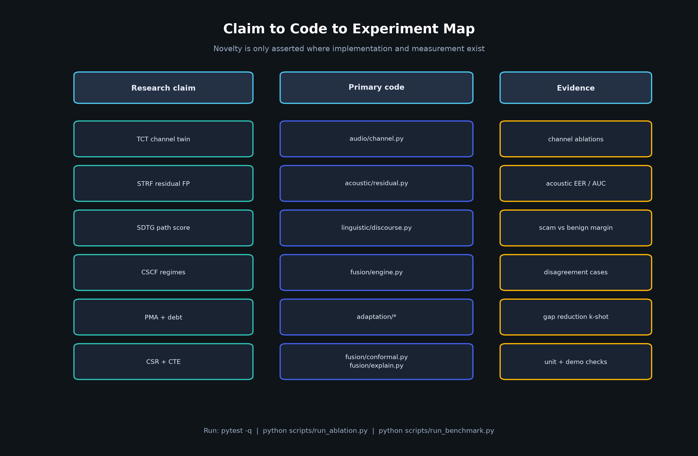

# Novelty: Evidence-Based (Not Marketing)

**Read this with:** `PRIOR_ART.md` (landscape), `RESEARCH.md` (claim to code to test), `PATENT_PATHWAY.md` (filing links).



## Rule

A feature is **novel for our purposes** only if:

1. It is **implemented** in this repository, and
2. It has a **measurable ablation or experiment**, and
3. It is **differentiated** from cited prior art in `PRIOR_ART.md`.

Anything else is labeled **roadmap**, not novelty.

## Differentiated technical contributions

### 1. Joint streaming telephony dual-stream stack (system claim)

**Not claimed as novel alone:** keyword fraud detection; generic deepfake classification; weighted audio and text average (exists in multimodal vishing papers).

**Claimed combination:** continuous **STRF acoustic** plus **SDTG linguistic path** plus **CSCF co-activation and regimes** under **TCT** channel conditions, with **PMA coverage-debt** feedback.

- Code: `pipeline.py`, full package
- Evidence: `scripts/run_benchmark.py`, `scripts/run_ablation.py`
- Prior art gap: late-fusion multimodal vishing lacks causal co-activation, regimes, debt loop, and a telephony residual stack as one system

### 2. STRF under explicit Channel Twin evaluation doctrine


- Code: `acoustic/residual.py`, `audio/channel.py`
- Evidence: acoustic EER and AUC across clean, narrowband, and harsh VoIP
- Prior art: channel augmentation exists; we standardize TCT as a generative twin for stress testing and optional live injection, with grid residual cues tuned for bandlimited vocoder artifacts
- Limit: not yet ASVspoof-trained SSL. Do not claim state-of-the-art EER.

### 3. SDTG: scam script as streaming stage machine


- Code: `linguistic/discourse.py`
- Evidence: path score much higher on scam scripts than benign; progression depth on scripts
- Prior art: dialogue acts exist in NLP; rare as real-time vishing path likelihood fused with acoustics

### 4. CSCF: co-activation, disagreement regimes, joint trajectory


- Code: `fusion/engine.py`
- Evidence: ablation of CSCF versus naive sum and unimodal paths; social-engineering and deepfake-probe flags
- Prior art: weighted-sum multimodal systems; we add regime taxonomy and temporal co-activation

### 5. PMA plus coverage-debt control loop and challenge-response


- Code: `acoustic/scorer.py`, `adaptation/coverage.py`, `adaptation/hooks.py`
- Evidence: gap reduction after k-shot; debt snapshot
- Prior art: few-shot prototypical anti-spoofing papers exist; we couple debt into fused call risk operations

### 6. CSR and CTE on fused call risk

- Code: `fusion/conformal.py`, `fusion/explain.py`
- Evidence: unit tests; demo intervals and counterfactuals
- Prior art: conformal prediction is general; application to streaming dual-stream telephony risk with abstention is the system-level claim

## What we explicitly do not claim

| Overclaim | Reality |
|-----------|---------|
| Best ASVspoof EER | No public ASVspoof training run in-repo yet |
| Invented deep learning | PMA and STRF are lightweight; SSL is optional future work |
| Invented keyword fraud detection | Patterns are a tactical baseline |
| Invented weighted fusion | Naive sum is our baseline to beat |
| Legal or regulatory certification | Research system only |

## Reproduce evidence

```bash
pytest -q
python scripts/run_benchmark.py
python scripts/run_ablation.py
```

If a gate fails, fix the algorithm before updating patent language.
