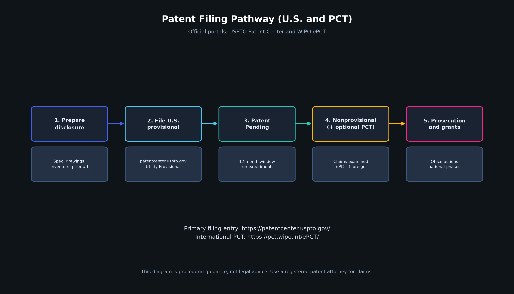

# Patent Pathway: Where to File (Official Links)

**Disclaimer:** This is practical filing navigation, **not legal advice**. Software and AI patents face Section 101 (Alice) scrutiny in the U.S. Use a registered patent attorney for claim drafting, prior-art clearance, and entity status (micro, small, or large).

ShieldCall's patentable angle is the **specific technical combination** (telephony residual fingerprinting, streaming discourse path scoring, co-activation fusion, and coverage-debt adaptation loop), not "detecting scams with AI."

---

## A. Fastest U.S. path: provisional, then nonprovisional (12 months)

### Step 0. Prepare before you click "file"

1. Written description (how it works, embodiments, diagrams).
2. Drawings and flowcharts (pipeline, fusion, adaptation loop). Use the rendered figures in `docs/figures/`.
3. Inventor list and ownership (assignment to company if any).
4. Decide **micro**, **small**, or **large** entity (fee level).
5. **Do not** publicly disclose (blog, demo video, GitHub public details of claims) before filing if you want maximum international options. Public disclosure can burn foreign rights.

> Your GitHub repository is currently **private**. Keep critical claim language and unpublished experiments private until the provisional is filed.

### Step 1. Create USPTO.gov and Patent Center account

| What | Official link |
|------|----------------|
| **USPTO home** | https://www.uspto.gov/ |
| **Patent Center (file and manage applications)** | https://patentcenter.uspto.gov/ |
| **Patent Center info and help** | https://www.uspto.gov/patents/apply/patent-center |
| **File online overview** | https://www.uspto.gov/patents/apply |
| **Create or manage USPTO.gov account** | https://account.uspto.gov/ |

### Step 2. Learn provisional requirements

| What | Official link |
|------|----------------|
| **Provisional application basics** | https://www.uspto.gov/patents/basics/apply/provisional-application |
| **Provisional filing guide** | https://www.uspto.gov/patents-getting-started/patent-basics/types-patent-applications/provisional-application-patent |
| **Provisional cover sheet SB/16 (Patent Center version)** | https://www.uspto.gov/sites/default/files/documents/sb0016pc.pdf |
| **All patent forms** | https://www.uspto.gov/patents/apply/forms |
| **USPTO video: drafting provisionals** | https://www.uspto.gov/learning-and-resources/uspto-videos/path-patent-part-ii-drafting-provisional-patent-applications |

### Step 3. File the provisional in Patent Center

1. Go to: **https://patentcenter.uspto.gov/**
2. Sign in.
3. **New submission**, then **Utility Provisional**.
4. Upload specification PDF (include or attach the PNG figures from `docs/figures/`).
5. Complete cover sheet (inventors, title, correspondence).
6. Pay provisional filing fee.
7. Save filing receipt and application number. You may mark materials **"Patent Pending."**

**Fee schedule (verify live amounts):** 
https://www.uspto.gov/learning-and-resources/fees-and-payment/uspto-fee-schedule

Provisional fee codes are listed under patent application filing fees (large, small, and micro columns differ).

**Payments hub:** 
https://www.uspto.gov/learning-and-resources/fees-and-payment

### Step 4. Within 12 months: nonprovisional (examined utility patent)

| What | Official link |
|------|----------------|
| **Apply for a patent (overview)** | https://www.uspto.gov/patents/basics/apply |
| **Nonprovisional utility (file in Patent Center)** | https://patentcenter.uspto.gov/ |
| **Patent process timeline** | https://www.uspto.gov/patents/basics/patent-process-overview |
| **Subject matter eligibility (Alice / MPEP 2106)** | https://www.uspto.gov/web/offices/pac/mpep/s2106.html |
| **Find a registered patent attorney or agent** | https://oedci.uspto.gov/OEDCI/ |

Nonprovisional requires: claims, oath or declaration, fees (filing, search, and examination), and proper drawings.

---

## B. International: PCT (optional, usually after or with U.S. filing)

Gives about 30 or 31 months from the priority date to enter national phases (country by country).

| What | Official link |
|------|----------------|
| **PCT system overview (WIPO)** | https://www.wipo.int/en/web/pct-system |
| **How to file a PCT application** | https://www.wipo.int/en/web/pct-system/filing/index |
| **ePCT portal (file and manage international applications)** | https://pct.wipo.int/ePCT/ |
| **ePCT about and login** | https://pct.wipo.int/ePCT/about-epct.xhtml |
| **Create WIPO account for ePCT** | https://pct.wipo.int/wipoaccounts/en/ePCT/public/register.xhtml |
| **PCT Applicant's Guide** | https://www.wipo.int/en/web/pct-system/guide |
| **Receiving Offices accepting ePCT** | https://pct.wipo.int/ePCTExternal/pages/EFilingServers.xhtml |

U.S. applicants often file PCT via:

- **USPTO as Receiving Office** through **Patent Center**, or
- **WIPO International Bureau** via **ePCT**.

---

## C. Prior-art search (do this before or while drafting)

| Tool | Link |
|------|------|
| **USPTO Patent Public Search** | https://ppubs.uspto.gov/pubwebapp/ |
| **Google Patents** | https://patents.google.com/ |
| **Espacenet (EPO)** | https://worldwide.espacenet.com/ |
| **WIPO Patentscope** | https://patentscope.wipo.int/ |
| **Scholar (papers)** | https://scholar.google.com/ |

Suggested queries: see `docs/PRIOR_ART.md`.

---

## D. Trademark (optional, brand name "ShieldCall")

Separate from patents:

| What | Link |
|------|------|
| **USPTO trademarks** | https://www.uspto.gov/trademarks |
| **TESS search** | https://tmsearch.uspto.gov/ |

---

## E. Recommended sequence for this project

1. **Weeks 0 to 2:** Freeze invention disclosure from `ARCHITECTURE.md`, `PRIOR_ART.md`, code, and rendered figures. Run attorney prior-art search. Draft provisional specification.
2. **File day:** File provisional at https://patentcenter.uspto.gov/ for Patent Pending status.
3. **Months 1 to 11:** Run ablations and ASVspoof plus TCT experiments. Add embodiments to the notebook. Optionally improve code without public claim spoilers. Draft nonprovisional claims with counsel.
4. **Month 12:** File U.S. nonprovisional claiming priority to the provisional. Optionally file PCT the same day via ePCT or Patent Center.
5. **Years 1 to 3 and beyond:** Prosecution (office actions), national phase entries, continuations.

---

## F. Entity status and cost awareness

| Resource | Link |
|----------|------|
| **Micro entity** | https://www.uspto.gov/patents/laws/micro-entity-status |
| **Small entity** | https://www.uspto.gov/web/offices/pac/mpep/s509.html |
| **Current fee schedule** | https://www.uspto.gov/learning-and-resources/fees-and-payment/uspto-fee-schedule |

Expect: provisional USPTO fee (low hundreds or less for micro) **plus** attorney drafting (often the dominant cost). Nonprovisional, PCT, and national phases are multi-thousand to tens of thousands depending on countries and counsel.

---

## G. What to put in the provisional for ShieldCall

Minimum technical content (map to code and figures):

1. System diagram (dual stream and fusion): `figures/architecture_pipeline.png`
2. TCT channel operations (bandlimit, mu-law, packet loss and PLC): `figures/tct_strf.png`
3. STRF residual feature vector and scoring
4. SDTG stages, transitions, path score: `figures/sdtg_stages.png`
5. CSCF: co-activation window, regimes, trajectory: `figures/cscf_regimes.png`
6. PMA, coverage-debt metric, and challenge-response enrollment: `figures/adaptation_loop.png`
7. CSR conformal band and abstention
8. CTE counterfactual generation
9. Streaming frame timing (hop and frame)
10. Alternate embodiments (cloud service, on-device ONNX, contact-center SBC tap)

Use `docs/ARCHITECTURE.md`, `docs/PRIOR_ART.md`, `docs/figures/`, and source under `shieldcall/` as the backbone of the specification.

---

## H. One-click filing entry points (bookmark these)

1. **File U.S. provisional or nonprovisional:** https://patentcenter.uspto.gov/
2. **USPTO apply hub:** https://www.uspto.gov/patents/apply
3. **Fees:** https://www.uspto.gov/learning-and-resources/fees-and-payment/uspto-fee-schedule
4. **International PCT:** https://pct.wipo.int/ePCT/
5. **Find patent attorney:** https://oedci.uspto.gov/OEDCI/
